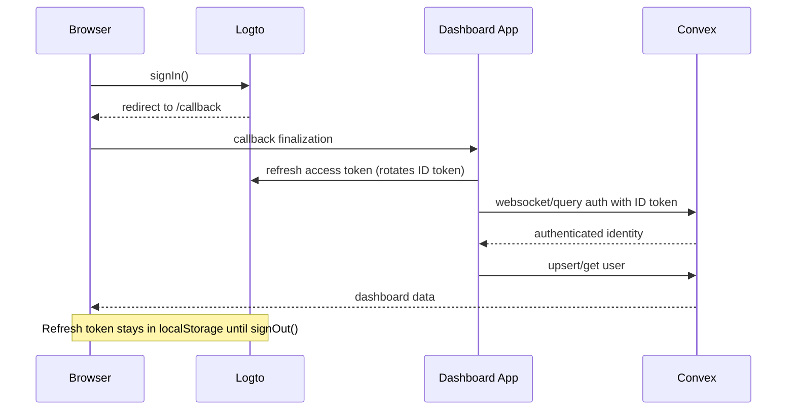
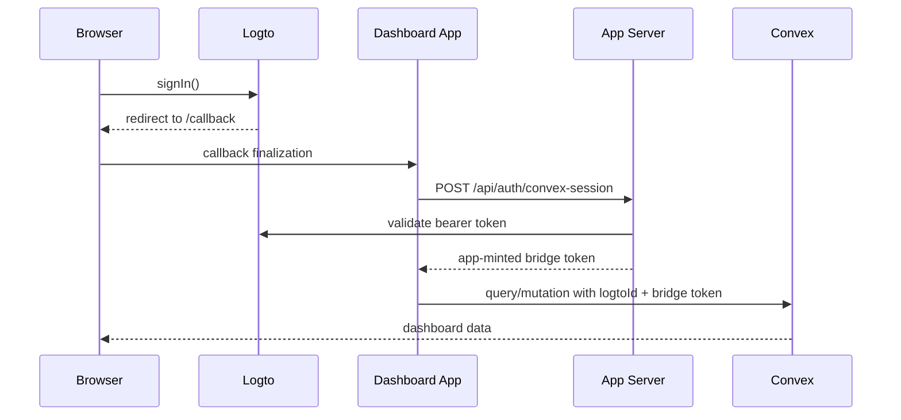

# Dashboard Auth Runbook

## Current Modes

- `AUTH_BRIDGE_MODE=native` (**default**): browser Logto auth plus native Convex OIDC JWT auth via `convex/auth.config.ts`. Logto refresh tokens persist in `localStorage`, so users stay signed in until they explicitly sign out.
- `AUTH_BRIDGE_MODE=legacy`: browser Logto auth plus app-minted 5-minute Convex bridge token (rollback only).

Self-hosted Convex **does** support this native path. What is unsupported out of the box is the separate `@convex-dev/auth` component product — not `auth.config.ts` JWT validation. Production already ships `convex/auth.config.ts` for Logto.

## Required Self-Hosted Settings

### App container

- `AUTH_BRIDGE_MODE=native`
- `VITE_AUTH_BRIDGE_MODE=native` (must match)
- `LOGTO_ENDPOINT` (Logto base URL, e.g. `https://auth.example.com`)
- `VITE_LOGTO_ENDPOINT`
- `VITE_LOGTO_APP_ID`
- `VITE_LOGTO_REDIRECT_URI`
- `VITE_LOGTO_SCOPES`
- `VITE_CONVEX_URL`

### Convex deployment

- `LOGTO_ENDPOINT` (same base URL as the app; `auth.config.ts` appends `/oidc` to match the ID token `iss`)
- `LOGTO_APP_ID`

## Why Sessions Felt Short-Lived Before

1. Legacy bridge tokens expire every 5 minutes and recovery cleared Logto tokens on mint failure.
2. Native mode was incomplete: Convex was not forced to refresh Logto ID tokens, and bootstrap could race an expired ID token.
3. Convex `auth.config.ts` must use the Logto OIDC issuer (`{endpoint}/oidc`), not the bare base URL.

## Flow Diagrams

### Native Sign-In (default)

### Legacy Sign-In (rollback)

## Validation Checklist

1. Confirm app + Convex both have matching Logto app id and endpoint.
2. Confirm Convex accepts Logto identities and `ctx.auth.getUserIdentity()` resolves.
3. Validate login, hard refresh, browser restart, stale `/callback`, logout, and account switch.
4. Confirm no flow requires clearing cookies or local storage except explicit Sign out.
5. Validate rollback by switching only `AUTH_BRIDGE_MODE=legacy` / `VITE_AUTH_BRIDGE_MODE=legacy`.

## Failure Triage

- `reason=stale-callback`: browser callback state drifted; the app clears local SDK tokens and retries.
- `reason=session-init`: bootstrap failed after bounded retry. Native mode preserves the Logto refresh token and re-bootstraps once before offering another OAuth login.
- Native-mode regression: switch `AUTH_BRIDGE_MODE=legacy`, redeploy app, keep Convex auth config in place.

## Evidence To Capture In Staging

- browser HAR
- browser storage snapshot (`logto:*:refreshToken` present after refresh)
- app logs filtered by `type=auth_event`
- Logto auth event logs
- Convex logs around identity resolution and user lookup

## Secrets

- Never expose `LOGTO_M2M_APP_SECRET` or `CONVEX_SESSION_SECRET` in client-visible env vars.
- `VITE_LOGTO_APP_SECRET` must remain unset.
- Rotate any previously exposed local secrets before production rollout.
